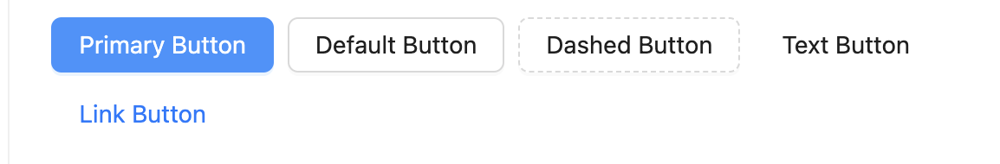
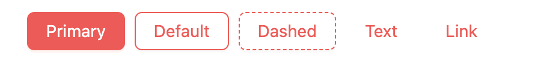
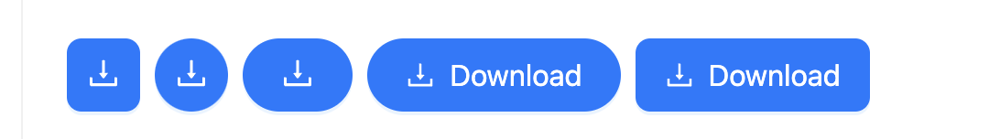
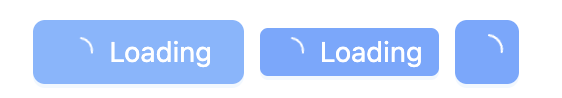

在 `antd` 中，`Button` 组件不仅具备基础的点击功能，还提供了丰富的样式和配置，满足从简单到复杂的各种应用场景。它的灵活性和易用性使得开发者可以轻松地实现各种按钮交互，从而极大地提升用户体验。

本文旨在深入探讨 `antd` 的 `Button` 组件，从基本使用方法到源码层面的解析。我们将从如何在项目中引入和使用 `Button` 开始，探索其丰富的属性和用法，然后深入到其背后的源码实现。
# 基本使用
## 引入
```ts
import {Button} from 'antd'
```
## 使用
常用的属性介绍
 ### 1. type
`button` 的 `type` 属性是最常用的一个，type 的值有 `primary`、`dashed`、`text`、`link` 和 `default`，也就是说 `button` 有五种样式。
```ts
<Button type="primary">Primary Button</Button>
<Button>Default Button</Button>
<Button type="dashed">Dashed Button</Button>
<Button type="text">Text Button</Button>
<Button type="link">Link Button</Button>
```
对应的样子，如下：

### 2. danger
对于危险的按钮可以设置`danger`属性

```ts
<Button type="primary" danger>Primary</Button>
<Button danger>Default</Button>
<Button type="dashed" danger>Dashed</Button>
<Button type="text" danger>Text</Button>
<Button type="link" danger>Link</Button>
```
以下是五种不同的按钮设置“`danger`”对应的样式：

### 3. icon
我们可以通过icon属性来设置button的图标

```ts
<Button type="primary" icon={<DownloadOutlined />}  />
<Button type="primary" shape="circle" icon={<DownloadOutlined />}  />
<Button type="primary" shape="round" icon={<DownloadOutlined />}  />
<Button type="primary" shape="round" icon={<DownloadOutlined />} >Download</Button>
<Button type="primary" icon={<DownloadOutlined />} >Download</Button>
```
可以发现，如果前面不设定文字，就可以形成图标样式的按钮类型。


### 4. loading
在我们进行请求操作时，需要等待接口信息返回成功或失败。为了避免由于连续点击而发起多次请求，同时为了提高用户体验，我们有时会给按钮增加`loading`动画，表示当前按钮正在执行中。

```ts
// 设置lodading变量
const [loadings, setLoadings] = useState<boolean[]>([]);

<Button
    type="primary"
    icon={<PoweroffOutlined />}
    // 当loading=true则会变化加载中状态
    loading={loadings} 
    // 当点击按钮之后，将loading变为true
    onClick={() => setLoadings(true)}
/>
```
在上面的代码我们通过`onClick`来触发按钮点击



## 源码分析
源码地址：  `/ant-design/components/button/button.tsx`


`Button`使用原生的`button`，不过，当存在`href`属性的时候，使用的是`a`标签。
代码如下：
```ts
if (linkButtonRestProps.href !== undefined) {
  return wrapCSSVar(
    <a
      {...linkButtonRestProps}>
    </a>,
  );
}
```

对于button的代码，也很好理解
```ts
<button
    {...rest}
    type={htmlType}
    className={classes}
    style={fullStyle}
    onClick={handleClick}
    disabled={mergedDisabled}
    ref={buttonRef as React.Ref<HTMLButtonElement>}
>
    {iconNode}
    {kids}
    {/* Styles: compact */}
    {compactItemClassnames && <CompactCmp key="compact" prefixCls={prefixCls} />}
</button>
```

#### 1. `type = htmlType`
对于`type = htmlType`，其类型定义为 `const htmlType: "button" | "submit" | "reset"`。 当我们传递参数时，`htmlType` 的默认值为`htmlType = 'button'`。因此，如果我们不输入这个参数，它的值就会是`'button'`。在填写表单时，我们会使用`htmlType=submit`来触发`form`的提交。
#### 2. className
`className`就是我们理解的class，`button`是有className的参数。因此，`classes`不仅包含我们传递的`className`这个`props`，还包含自己的变量。这一点可以通过下面的代码看出。
```ts
const classes = classNames(
   prefixCls,
   {
   [`${prefixCls}-${shape}`]: shape !== 'default' && shape,
   [`${prefixCls}-${type}`]: type,
   [`${prefixCls}-${sizeCls}`]: sizeCls,
   [`${prefixCls}-icon-only`]: !children && children !== 0 && !!iconType,
   },
   className,
);
```
这里有一个小`tips`，看到他将这些`class`拼接起来用的一个类库是
```ts
import classNames from 'classnames';
```
这个库很好用，它可以轻松地合并多个类名，无论是静态的还是动态的。

```ts
classNames({
    'btn': true, // 总是应用
    'btn-primary': primary, // 当 primary 为 true 时应用
    'btn-disabled': disabled, // 当 disabled 为 true 时应用
});
```
所以上面拼接出来的`class='btn btn-primary btn-disabled'`
#### 3. disbaled
上面的代码disbaled的获取值是  
```ts
const {
    disabled: customDisabled,
} = props;
const disabled = React.useContext(DisabledContext);
const mergedDisabled = (customDisabled ?? disabled) || loading;
```
从上面的代码我们可以学到props通过：给参数起别名
`mergedDisabled`值是若`customDisabled`不存在则获取`disabled`，其次disabled是从context中获取的。

#### 4. composeRef

对于 `ref={buttonRef as React.Ref<HTMLButtonElement>}`，其值 `buttonRef` 是由 `const buttonRef = composeRef(ref, internalRef);` 得到的。我们可以看到这里使用了一个 `composeRef` 方法。
这个方法的来源是
```ts
import { composeRef } from 'rc-util/lib/ref';
```

它用于组合多个 `ref` 的引用。在 React 中，`ref` 用于直接访问 DOM 元素或 React 组件实例。有时候，你可能需要将多个 `ref` 应用到同一个元素或组件上。`composeRef` 就是为此设计的。

我们已经了解了上述 button 的 jsx 代码，现在让我们看看其他部分的代码。

```ts
const Button = forwardRef<HTMLButtonElement | HTMLAnchorElement, ButtonProps>(
  InternalButton,
) as CompoundedComponent;

if (process.env.NODE_ENV !== 'production') {
  Button.displayName = 'Button';
}
```

上面的`button`组件名被称为`InternalButton`，然后使用f`orwardRef`来包裹它的`Button`。最后，将`displayName`的值设置为`Button`。让我们来看看f`orwardRef`和`displayName`的主要用途。

#### forwardRef
`forwardRef` 是 React 库中的一个高阶函数，用于转发引用（refs），主要解决了在高阶组件（HOCs）和函数式组件中引用（ref）传递的问题。
在 React 中，refs 提供了一种访问 DOM 节点或在组件树中创建的 React 元素的方式。但是，由于 refs 不遵循常规的数据流，它们不能直接通过 props 传递给子组件。这就是 `forwardRef` 为什么存在的理由。
简单说就是普通的租金把ref当作props的参数传递给子组件，子组件是无法收到的。

**作用**
- **转发 refs 到 DOM 组件**：使得父组件能够直接访问子组件的 DOM 节点。
- **在高阶组件中使用**：当你使用高阶组件（HOC）时，`forwardRef` 可以将 ref 透传给被包裹的组件，确保 ref 的正确性。
- **函数式组件中使用 Refs**：在函数式组件中，由于没有实例，不能直接使用 ref。`forwardRef` 提供了在函数式组件中使用 ref 的能力。

#### displayName的作用
1. **调试方便**：当你查看 React 开发者工具中的组件树时，`displayName` 提供了一个清晰的、易于理解的组件名称，特别是在使用高阶组件（HOCs）或函数式组件时，它能让组件的识别变得更直观。
2. **高阶组件（HOC）**：在使用高阶组件时，`displayName` 尤其重要。高阶组件可能会修改或包装原始组件，使得原始组件的名称不再明显。通过设置 `displayName`，可以确保即使在被高阶组件包装后，原始组件的名称也能在开发者工具中清晰显示。
3. **函数式组件**：对于函数式组件，React 默认使用函数的名称作为 `displayName`。但如果函数式组件是通过箭头函数定义的，或者是作为参数传递给高阶组件的，那么它可能没有显示名称。在这种情况下，手动设置 `displayName` 可以提供更好的调试体验。

# 结论
通过看一个button的源码，我们就可以学习到不少东西，这些东西平时很难注意到 
1. displayName作用
2. forwardRef注意事项
3. classnames库的使用
4. composeRef库的使用