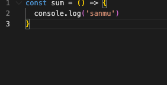
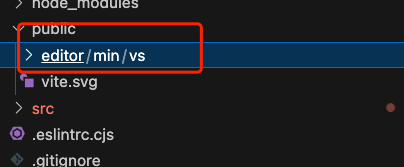
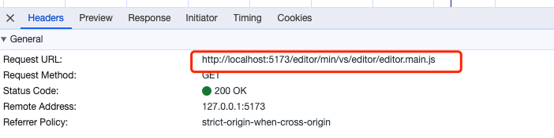

今天介绍一个代码编辑器，用于在web端使用。

# 概述

Monaco Editor 是一个基于浏览器的代码编辑器，由 Microsoft 开发，是 Visual Studio Code 的核心编辑器组件。提供一个丰富功能且性能优异的代码编辑环境，用于 web 应用。 如果有代码编辑器的需求，引入Monaco，基本上可以实现你所有需要的功能，可以简单理解成web版本的vscode。

### 基本功能

- **代码编辑**：基本的文字编辑功能，包括插入、删除、选择和复制代码。
- **语法高亮**：根据不同的编程语言自动高亮显示代码。
- **代码折叠**：允许用户折叠代码块，以简化代码视图。
- **多光标编辑**：同时在多个位置编辑代码。


### 特性优势

- **高性能**：快速响应，即使是在处理大型文件时也能保持流畅。
- **丰富的 API**：提供广泛的 API 支持，方便开发者扩展和自定义编辑器。
- **易于集成**：可以轻松地嵌入到现有的 Web 应用中。

# 使用方法

**通过 NPM 安装**：

```bash
npm install monaco-editor
npm i @monaco-editor/react # react版本

```

**使用**

```jsx
import Editor from '@monaco-editor/react';

const MonacoEditor = () => {
  return (
    <Editor
      language="javascript"
      value={`const sum = () => {
  console.log('sanmu')
}`}
      theme="vs-dark"
      onChange={(value) => {
        console.log('change', value);
      }}
    />
  );
};

export default MonacoEditor;
```

通过上面的代码我们就可以搭建一个基础的编辑器了，查看下图



同时，右键包含了一些我们在vscode中常见的命令。


对于大部分的场景，以上的默认的配置就已经可以支持了。

如果你想增加一些自定义快捷键，可以通过配置 `registerCompletionItemProvider`

下面的代码标识，注册`conLog`快捷输入，将会插入`console.log`

```jsx
const handleEditorDidMount = (editor, monaco) => {
  monaco.languages.registerCompletionItemProvider('javascript', {
    provideCompletionItems: () => {
      return {
        suggestions: [
          {
            label: 'conLog',
            kind: monaco.languages.CompletionItemKind.Snippet,
            insertText: 'console.log(${1:});',
            insertTextRules:
              monaco.languages.CompletionItemInsertTextRule.InsertAsSnippet,
            documentation: 'Insert console.log()',
          },
        ],
      };
    },
  });
};

<Editor
 ...
 onMount={handleEditorDidMount}
/>
```

在编辑器里面，当我们输入con的时候，便会获取到

至此我们的编辑器就算搭建完成了。

如果想比对代码的的话，可以使用下面 `DiffEditor`

```jsx
import { DiffEditor } from '@monaco-editor/react';

const MonacoDiffEditor = () => {
  const originalCode = `const sum = () => {
  console.log('original')
}`;
  const modifiedCode = `const sum = () => {
  console.log('modified')
}`;

  return (
    <DiffEditor
      original={originalCode}
      modified={modifiedCode}
      language="javascript"
      theme="vs-dark"
    />
  );
};

export default MonacoDiffEditor;
```


# 其他

现在功能上来说，已经完成了，但是还是存在一个问题。就是目前编辑器的加载是从cdn的，如果遇到无网或者网络环境不好，编辑器就无法使用了。


这里有两个方案

1. 使用loader函数加载本地的包
2. 将cdn的资源下载到本地使用

方案1，我在试用的过程中能够正常加载，但是会一直报错。

所以采用方案2

下载地址：[https://www.jsdelivr.com/package/npm/monaco-editor?tab=files&path=min](https://www.jsdelivr.com/package/npm/monaco-editor?tab=files&path=min)

将下载包里面的min文件夹复制出来

倒入到我们的项目中

在我们的编辑器中增加如下代码
```jsx
import Editor, { loader } from '@monaco-editor/react'; 
const MonacoEditor = () => { 
	loader.config({ paths: { vs: '/editor/min/vs' } }); 
...
};
```
此时，在看我们的浏览器加载的包就是本地的了
